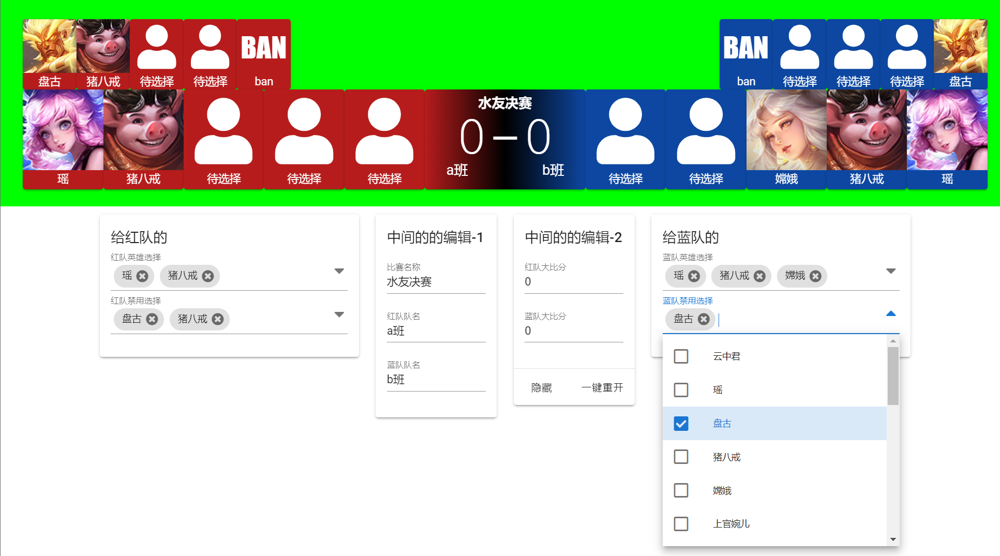

# wzry_hero_picker

基于vue 2.0的，一个非常粗糙的王者荣耀比赛，选择英雄时给观众看的底部条方案。



## 使用方法

可以使用我这边在线部署的：[wzpicker.iccmc.cc](https://wzpicker.iccmc.cc)

设定OBS，使用颜色键和裁剪功能将顶部的区域剪出来，然后放到你想放置的区域。

或者你也可以clone本项目，并自行通过Vue-cli构建。

## Project setup
```
npm install
```

### Compiles and hot-reloads for development
```
npm run serve
```

### Compiles and minifies for production
```
npm run build
```

### Lints and fixes files
```
npm run lint
```

### Customize configuration
See [Configuration Reference](https://cli.vuejs.org/config/).
